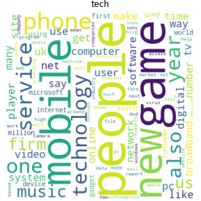
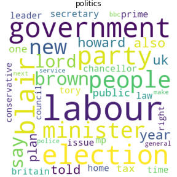
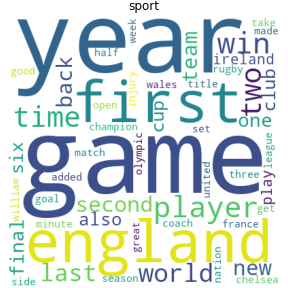
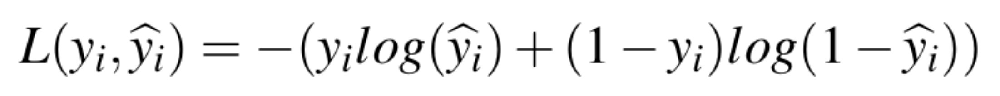
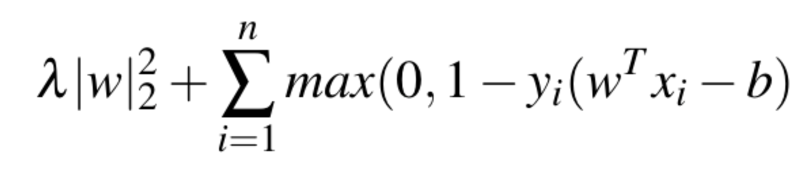
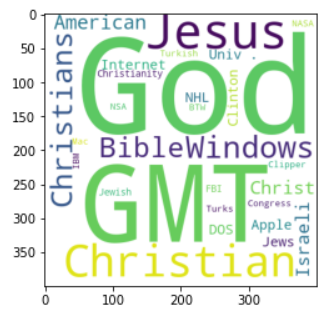

## Text Classification

  **Text Classification (TC)** and **Named-Entity Recognition (NER)** are two fundamental tasks for many Natural Language Processing (NLP) applications, which involve understanding, extracting information, and categorizing the text. In order to achieve such goals, we utilized **AutoPhrase** (Jingbo Shang 2018) and a pre-trained language NER model to extract quality phrases. Using these as part of our features, we are able to achieve high performance for a five class and a twenty class text classification dataset. Our project follows a similar setting as previous works with train, validation, and test datasets and comparing the results across different methods.
  
  Text classification is an important NLP task, which can be understood as a given set of text and labels. We want to create a classifier that can classify them in addition to other texts. Text classification tasks mainly involve understanding the text and extracting high quality phrases for model training. For example, if a text has "government" or "minister" as a frequent phrase or word, it is more likely to belong to 'Politics'. As such, it is important for us to extract quality phrases and make sure they represent these documents well.

## Data Sets
  
  **BBC News dataset:** 
  
  - includes 2,225 documents
  - spans 2004-2005 
  - composed of five categories e.g. Entertainment, Technology, Politics, Business, Sports
  - https://www.kaggle.com/pariza/bbc-news-summary

  **20 News Groups dataset:** 
  - includes 18,000 news groups posts
  - composed of twenty categories e.g. Computer, Science, Politics, Religion, etc.
  - http://qwone.com/~jason/20Newsgroups/

  

## Models

### AutoPhrase-based Model

  AutoPhrase has two major modules: **Robust Positive-Only Distant Training** and **POS-Guided Phrasal Segmentation**. The first module trains the model and determines the quality score for phrases. The second module determines which tokens should be combined together and constitute a phrase. AutoPhrase first estimates the quality score from frequent n-gram phrases. With these results, it then utilizes the segmentation module to revise the segmentation. Rather than using the n-gram based phrases, AutoPhrase estimates the final quality score based on the segmentation results. Since the AutoPhrase method is applicable to any domain and language, we utilized this method on both of our datasets to extract quality phrases. With these quality phrases, we adopt the same Bag-of-Words and TF-IDF processes to encode them into vectors.
  

### Pre-trained NER-based Model

**BERT (Bidirectional Encoder Representations from Transformers)** is a general-purpose language model trained on the large dataset. This pre-trained model can be fine-tuned and used for different tasks such as sentiment analysis, question answering systems, sentence classification, and Named-Entity Recognition. Named-Entity Recognition is the process of extracting noun entity from text data and classifies them into predefined categories e.g. person, location, organization and others. Hence, we can use a BERT-based Named-Entity Recognition model, fine-tuned on the CoNLL 2003 dataset, to extract noun entities in the BBC News data set and 20 News group datasets.

For our experiment, we have used the BERT-based uncased model as a baseline trained by the HuggingFace library with 110M parameters, 12 layers, 768-hidden, and 12-heads. For fine-tuning, we used the suggested parameters of max-seq-length=128, training epoch=3, and warm-up proportion=0.1. Then, we created the dataframe for BBC News summary data and used the model to predict the entity by each sentence of the document. We followed the same procedure for the 20 News dataset.

**p-value** | **Phrases**
    0.9888640523 | george bush
    0.9873576373 | red sox 
    0.9863977181 | attorney general
    0.9858852675 | gulf war
    0.9856553314 | silicon graphics
    0.9853577556 | vice president
    0.9849079262 | united nations
    0.9846998338 | soviet union
    0.9845569952 | north america
    0.9842812319 | south africa

## Experiment

**Logistic Regression** is a binary classifier model that is widely adopted for many research projects and real-world applications. As such, we included this model in our experiment as well. This model is optimized by minimizing the **Logistic Loss** (Equation 1). 

A **Support Vector Machine (SVM)** is a supervised model intended for solving classification problems. The SVM algorithm creates a line or a hyper-plane, which separates the data into classes. This model is optimized by minimizing the **Hinge Loss** (Equation 2)

The architecture of BERT's transfer learning is made up by a fully-connected layer, a drop-out layer, a **Rectified Linear Unit (ReLU)** activation layer, a second fully-connected layer, and a **soft-max** activation layer. For the optimizer, we used **AdamW**, an improved version of **Adam**, and opted to use the _negative_ log-likelihood loss, which is well-suited for multiple-class classification. For training, we used a learning rate of exp(-4) for 40 epochs. Due to GPU resources, we were only able to perform training and evaluation on the BBC News dataset.

_reference:_ https://www.analyticsvidhya.com/blog/2020/07/transfer-learning-for-nlp-fine-tuning-bert-for-text-classification/

## Results

### BBC News Dataset Validation Results

**Model**  | **Weighted** | **Accuracy**
--- | --- | ---
LOG + UNI(BOW) | 0.9527 | 0.9528
SVM + UNI(BOW) | 0.9485 | 0.9483
SVM + ET(TF-IDF) | 0.9529 | 0.9528
SVM + AP(TF-IDF) | 0.9462 | 0.9461
SVM + ALL(TF-IDF) | 0.9639 | 0.9640

### 20 News Dataset Validation Results

**Model**  | **Weighted** | **Accuracy**
--- | --- | ---
LOG + UNI(BOW) | 0.7751 | 0.7759
SVM + UNI(BOW) | 0.7629 | 0.7589
SVM + ET(TF-IDF) | 0.8259 | 0.8282
SVM + AP(TF-IDF) | 0.8105 | 0.8125
SVM + ALL(TF-IDF) | 0.8466 | 0.8483

## Conclusion

The BERT classification on the five-class BBC News dataset does not outperform any of our implemented models. From our results table, we observed that our models have F1-Score and Accuracy performances at around _0.95_, indicating they are high-performing classifiers. The best of them is the **SVM+ALL(TF-IDF) classifier**, or the Support Vector Machine with the All Vector Vocabulary List and Tf-Idf Representations, which uses the vocabulary from both NER results and AutoPhrase results. Because the quality phrases between different domains are likely to differ, we expect these results to be optimal features for our predictors. 

For the 20 News Group dataset, the SVM+ALL(TF-IDF) classifer also outperformed the other models, with the F1-Score and Accuracy being _0.84_. Considering the classes are huge (i.e. 20 classes), these results verify our model is high-performing. Applying our best model on the five-class BBC News dataset, we attained a F1-Score at _0.9525_, and Accuracy at _0.9528_; while for the 20 News Group, we yielded a F1-Score at _0.8463_ and Accuracy at _0.8478_. 

## Acknowledgments
***We would like to give special thanks to our mentor Professor Jingbo Shang, who guided us our project and provided constructive suggestions alone the way. We would also like to give special thanks to Professor Aaron Fraenkel and our teaching assistants, who have given us meaningful lectures about structuring our data science project and providing suggestions from our code to our presentation.***

## References

1. Jialu Liu*, Jingbo Shang*, Chi Wang, Xiang Ren and Jiawei Han, "Mining Quality Phrases from Massive Text Corpora”, Proc. of 2015 ACM SIGMOD Int. Conf. on Management of Data (SIGMOD'15), Melbourne, Australia, May 2015. (* equally contributed)

2. Jingbo Shang, Jialu Liu, Meng Jiang, Xiang Ren, Clare R Voss, Jiawei Han, "Automated Phrase Mining from Massive Text Corpora", accepted by IEEE Transactions on Knowledge and Data Engineering, Feb. 2018.

3. Thomas Wolf and Lysandre Debut and Victor Sanh and Julien Chaumond and Clement Delangue and Anthony Moi and Pierric Cistac and Tim Rault and Rémi Louf and Morgan Funtowicz and Joe Davison and Sam Shleifer and Patrick von Platen and Clara Ma and Yacine Jernite and Julien Plu and Canwen Xu and Teven Le Scao and Sylvain Gugger and Mariama Drame and Quentin Lhoest and Alexander M. Rush, "Transformers: State-of-the-Art Natural Language Processing", in Proc. of the 2020 Conference on Empirical Methods in Natural Language (EMNLP' 20).

4. "Transfer Learning for NLP: Fine-Tuning BERT for Text Classification". 
https://www.analyticsvidhya.com/blog/2020/07/transfer-learning-for-nlp-fine-tuning-bert-for-text-classification/
